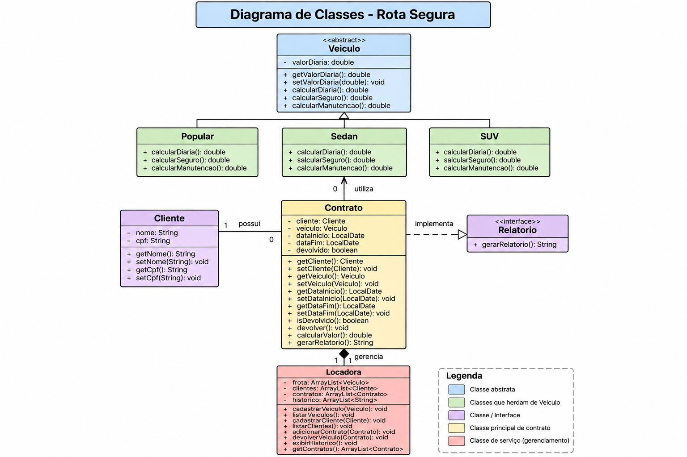

# Rota Segura - Sistema de Locação

**Aluno:** Matheus Yuri Sadamatsu Rodrigues  
**RA:** 1301392611037

## 1. Descrição

O Rota Segura é um sistema de locação de veículos desenvolvido em Java com
Programação Orientada a Objetos.

O sistema permite cadastrar e listar veículos e clientes, realizar locações,
verificar a disponibilidade dos veículos, calcular o valor da locação,
realizar a devolução e gerar relatórios do contrato.

O sistema também possui persistência do histórico de locações em arquivo de
texto.

## 2. Estrutura do projeto

```text
RotaSegura
├── docs
│   └── diagrama-classe-RotaSegura.png
├── src
│   ├── app
│   │   └── Main.java
│   ├── modelo
│   │   ├── Veiculo.java
│   │   ├── Popular.java
│   │   ├── Sedan.java
│   │   ├── SUV.java
│   │   ├── Cliente.java
│   │   ├── Contrato.java
│   │   └── Relatorio.java
│   └── servico
│       └── Locadora.java
├── README.md
├── .gitignore
└── .project
```

### Pacotes

- `app`: contém a classe principal responsável pela execução do sistema.
- `modelo`: contém as classes que representam os elementos do sistema.
- `servico`: contém a classe responsável pelo gerenciamento da locadora.

## 3. Conceitos de Programação Orientada a Objetos

### Encapsulamento

Os atributos das classes são protegidos utilizando `private`.

Por exemplo, o valor da diária em `Veiculo` é privado e seu acesso é feito
por métodos `get` e `set`.

Os métodos de alteração também possuem validações para impedir valores
inválidos.

### Abstração

A classe `Veiculo` é uma classe abstrata.

Ela define comportamentos que devem existir nos diferentes tipos de veículos,
como:

- calcular diária;
- calcular seguro;
- calcular manutenção.

### Herança

As classes `Popular`, `Sedan` e `SUV` herdam da classe abstrata `Veiculo`.

```text
Veiculo
   |
   +-- Popular
   +-- Sedan
   +-- SUV
```

### Polimorfismo

Os três tipos de veículos possuem os mesmos métodos definidos pela classe
`Veiculo`, mas cada classe implementa seus próprios cálculos.

Assim, uma referência do tipo `Veiculo` pode representar um `Popular`,
`Sedan` ou `SUV`.

### Interface

A interface `Relatorio` define o método:

```java
String gerarRelatorio();
```

A classe `Contrato` implementa essa interface para gerar o relatório da
locação.

### Generics

O sistema utiliza coleções genéricas para controlar os dados:

```java
ArrayList<Veiculo>
ArrayList<Cliente>
ArrayList<Contrato>
ArrayList<String>
```

Essas listas são utilizadas para armazenar a frota, os clientes, os contratos
e o histórico de locações.

## 4. Diagrama de classes



## 5. Funcionamento do sistema

O fluxo principal do sistema é:

1. Inicialização da locadora.
2. Cadastro dos veículos.
3. Listagem dos veículos cadastrados.
4. Cadastro do cliente.
5. Listagem dos clientes.
6. Escolha do tipo de veículo.
7. Informar as datas de início e fim da locação.
8. Verificação da disponibilidade do veículo.
9. Criação do contrato.
10. Cálculo do valor da locação.
11. Geração do relatório do contrato.
12. Devolução do veículo.
13. Fechamento da locação.
14. Registro da operação no histórico.

## 6. Regras de cálculo

Foram adotadas regras diferentes para cada tipo de veículo.

### Popular

- Diária: 100% do valor base.
- Seguro: 5% do valor base.
- Manutenção: 3% do valor base.

### Sedan

- Diária: 110% do valor base.
- Seguro: 8% do valor base.
- Manutenção: 5% do valor base.

### SUV

- Diária: 120% do valor base.
- Seguro: 12% do valor base.
- Manutenção: 7% do valor base.

Essas regras são aplicadas de forma polimórfica por cada especialização de
`Veiculo`.

## 7. Validações e tratamento de erros

O sistema possui validações para situações como:

- nome do cliente vazio;
- CPF vazio;
- opção de veículo inválida;
- opção não numérica;
- formato de data inválido;
- data de fim anterior ou igual à data de início;
- tentativa de alugar um veículo já ocupado no período;
- tentativa de devolver um veículo que já foi devolvido;
- valor de diária menor ou igual a zero.

As situações inválidas são tratadas utilizando exceções, principalmente
`IllegalArgumentException`, `DateTimeParseException` e
`InputMismatchException`.

## 8. Persistência

O histórico das locações é armazenado no arquivo:

```text
historico_locacoes.txt
```

O sistema utiliza `FileWriter` para registrar as locações e `Files` para
carregar o histórico existente.

O arquivo é utilizado para preservar o histórico das operações mesmo após o
encerramento do programa.

## 9. Como executar

### Eclipse

1. Abra o projeto `RotaSegura` no Eclipse.
2. Verifique se os arquivos estão dentro de `src`.
3. Localize:

```text
src/app/Main.java
```

4. Clique com o botão direito em `Main.java`.
5. Selecione:

```text
Run As > Java Application
```

6. Informe os dados solicitados pelo sistema no console.

### Execução pelo terminal

A partir da pasta raiz do projeto, também é possível compilar e executar
utilizando o Java:

```text
javac -d bin src/modelo/*.java src/servico/*.java src/app/Main.java
```

Depois:

```text
java -cp bin app.Main
```

## 10. Cenários de teste

### Fluxo normal

- Cadastro de cliente.
- Escolha de veículo.
- Informar datas válidas.
- Criação da locação.
- Cálculo do valor.
- Geração do relatório.
- Devolução do veículo.
- Fechamento da locação.

### Cálculo de veículos

Foram testados os três tipos:

- Popular.
- Sedan.
- SUV.

### Datas inválidas

Foi testada uma data de fim anterior à data de início.

Resultado esperado:

```text
A data de fim deve ser posterior à data de início.
```

Também foi testado um formato de data inválido.

### Opção de veículo inválida

Foi informada uma opção inexistente, como:

```text
5
```

Resultado esperado:

```text
Tipo de veiculo invalido.
```

### Entrada não numérica

Foi informada uma opção como:

```text
abc
```

Resultado esperado:

```text
Erro: a opcao deve ser um numero.
```

### Dados de cliente inválidos

Foram testados nome e CPF vazios.

O sistema rejeita os dados e apresenta uma mensagem de erro.

### Veículo indisponível

Foi testada uma tentativa de criar uma segunda locação para o mesmo veículo
em um período que entra em conflito com uma locação existente.

Resultado esperado:

```text
O veiculo ja esta alugado nesse periodo.
```

## 11. Tecnologias utilizadas

- Java
- Programação Orientada a Objetos
- `ArrayList`
- `LocalDate`
- Tratamento de exceções
- Persistência em arquivo de texto
- Git e GitHub